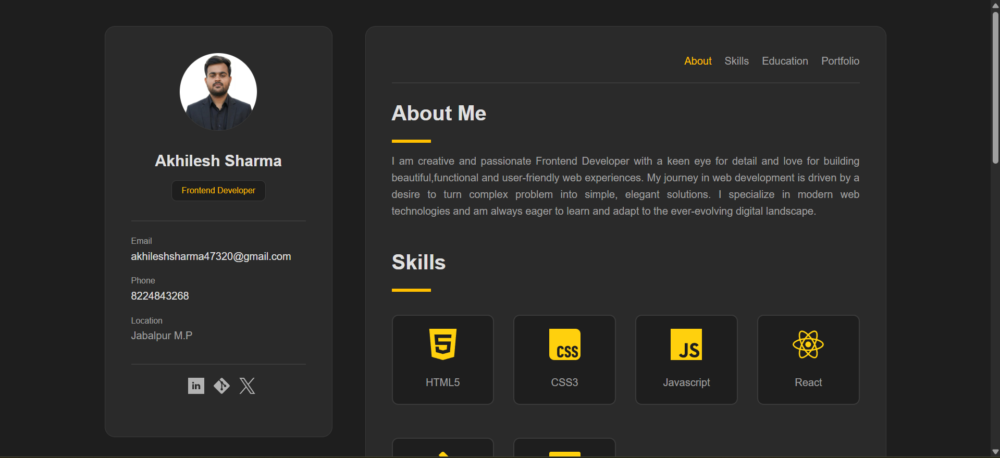

# Personal Portfolio Website

A fully responsive personal portfolio website built using HTML and CSS to showcase projects, technical skills, and achievements.

---

## 🚀 Live Demo
🔗 https://akhileshx07.github.io/portfolio-website/

---
## 📸 Preview

## 🛠 Tech Stack
- HTML5
- CSS3
- Flexbox
- Responsive Design

---

## 📌 Features
- Responsive layout for different screen sizes
- Project showcase section
- Skills section
- Clean and structured UI
- Smooth navigation

---

## 📂 Project Structure
portfolio-website/
│── index.html  
│── style.css  
│── images/  

---

## 👨‍💻 Author
Akhilesh Sharma  
B.Tech IT | DSA Enthusiast | MERN Learner
